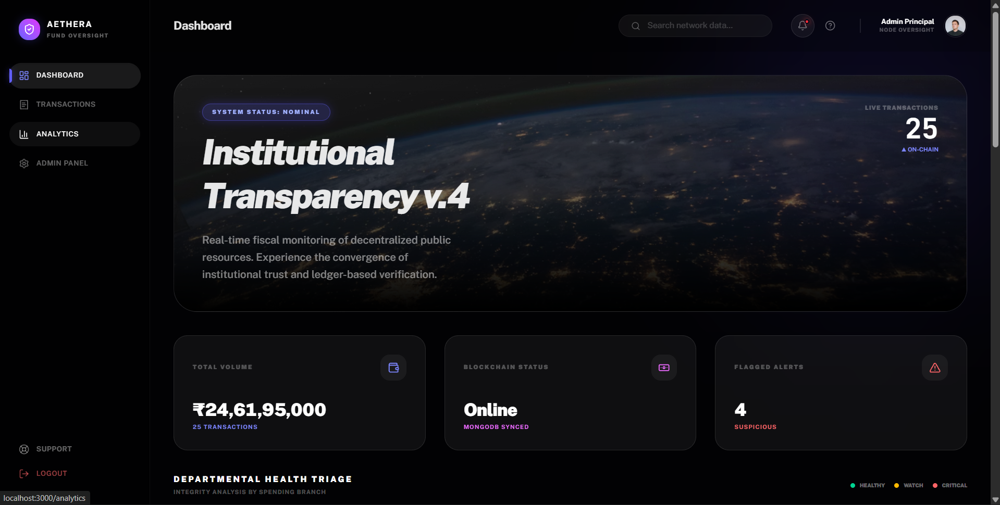
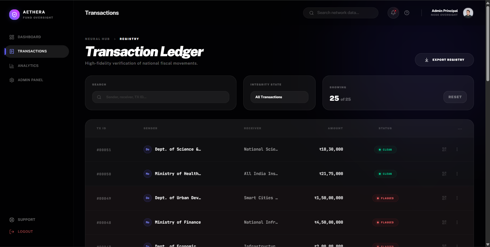
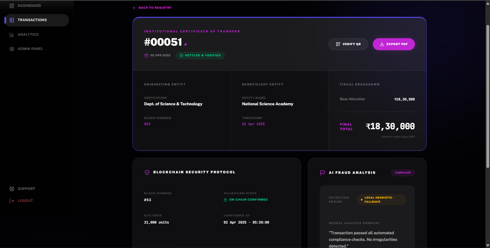
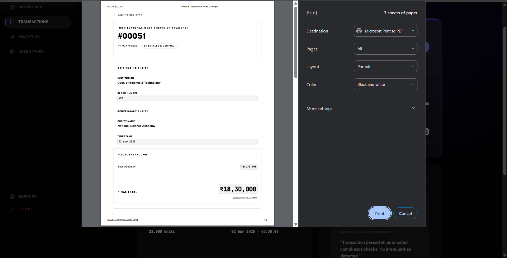
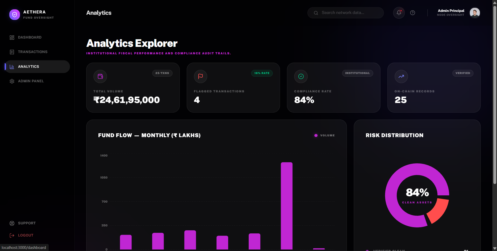
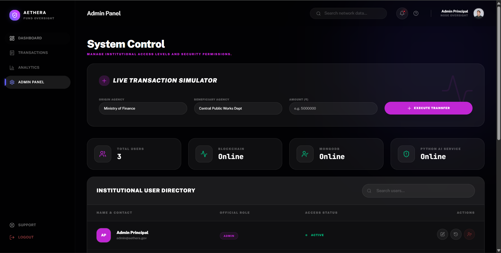
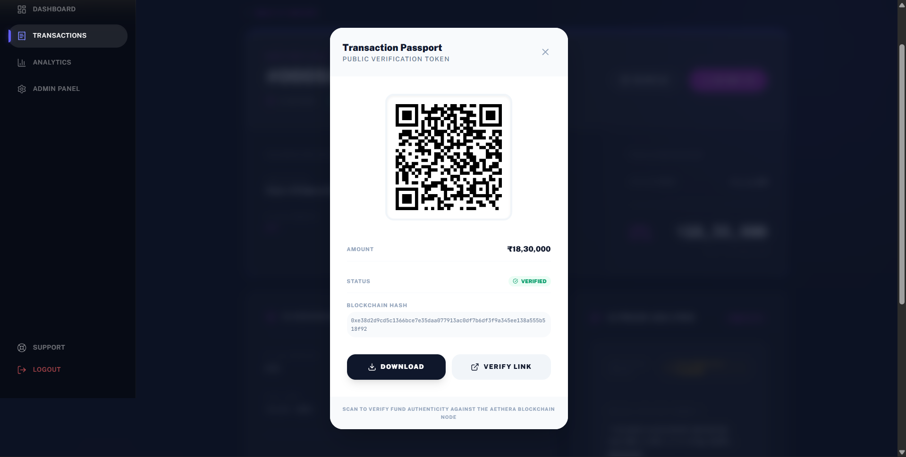
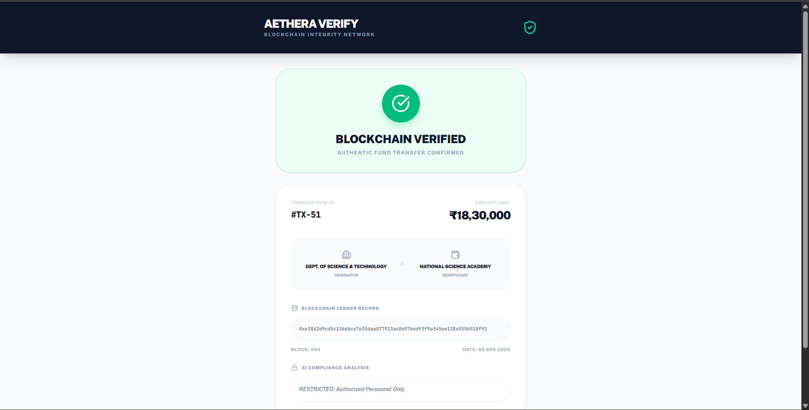

(Hackathon Prototype)
# 🌌 Aethera — Institutional Fund Governance Portal

> **Transparent by design. Immutable by nature.**

Aethera is a **blockchain-powered fiscal transparency platform** that enables end-to-end tracking of public funds on a tamper-proof Ethereum ledger, enhanced with AI-driven fraud detection and role-based access control.

---

## 🚨 The Problem

₹27 lakh crore flows through government systems annually — yet:
- No real-time public visibility  
- Delayed audits  
- Fund misallocation goes unnoticed  
- Citizens lack verification tools  

➡️ **Opacity enables corruption.**

---

## 💡 The Solution

Aethera introduces:
- 🔗 **Immutable transaction tracking** via Ethereum  
- 🤖 **AI-powered fraud detection** (heuristics + ML)  
- 👥 **Role-based dashboards** (Admin / Auditor / Public)  
- 📜 **Verifiable transaction certificates** (PDF + QR)  

➡️ **Every rupee becomes traceable, auditable, and verifiable.**

---

## 📸 Screenshots

### 📊 Dashboard


### 📜 Transaction Ledger


### 🔍 Transaction Details & Blockchain Certificate


### 📄 Transaction PDF Certificate


### 📈 Analytics Explorer


### 🛠️ Admin Panel


### 📱 QR Verification


### ✅ Verified QR


---

## 🏗️ Architecture
Frontend (React + Tailwind)
↓
Express API (Node.js)
↓
MongoDB (Metadata)
↓
Ethereum Smart Contracts (Immutable Ledger)
↓
Python FastAPI (AI Fraud Detection)


---

## ⚙️ Tech Stack

| Layer | Technology |
|------|-----------|
| Frontend | React 18, Vite, Tailwind CSS, Framer Motion |
| Backend | Node.js, Express.js, MongoDB, Ethers.js v6 |
| Blockchain | Solidity, Hardhat, Ethereum |
| AI Service | Python, FastAPI, Uvicorn |
| Auth | JWT (RBAC: Admin / Auditor / Public) |

---

## ✨ Key Features

- 🔗 Immutable blockchain ledger (Ethereum)
- 🤖 Dual-layer AI fraud detection  
- 👥 Role-based access control  
- 📜 PDF-based transaction certification  
- 📊 Real-time analytics dashboard  
- 📱 QR-based public verification  
- 🛡️ Full blockchain traceability  
- ⚡ Live system health monitoring  

---

## 🚀 Getting Started

### 1. Start MongoDB
```bash
mongod

2. Start Blockchain Node

```bash
cd backend
npx hardhat node

3. Deploy Smart Contract
```bash
npx hardhat run scripts/deploy.js --network localhost

4. Start Backend
```bash
cd backend
npm install
npm start

5. Start AI Service
cd python_service
pip install fastapi uvicorn pydantic
uvicorn main:app --port 5001

6. Start Frontend
cd frontend
npm install
npm run dev

Demo Table

| Role    | Email                                             | Password |
| ------- | ------------------------------------------------- | -------- |
| Admin   | [admin@aethera.gov](mailto:admin@aethera.gov)     | admin    |
| Auditor | [auditor@aethera.gov](mailto:auditor@aethera.gov) | auditor  |
| Public  | [public@aethera.gov](mailto:public@aethera.gov)   | public   |

🗂️ Project Structure
aethera/
├── frontend/
├── backend/
│   ├── contracts/
│   ├── scripts/
│   ├── routes/
│   ├── controllers/
│   ├── models/
│   ├── services/
│   └── seed/
└── python_service/

Roadmap
🔌 PFMS integration
🏦 RBI + CAG connectivity
📊 D3.js fund flow visualization
🔐 Multi-factor authentication
📱 Public mobile app
🌍 National-scale deployment
